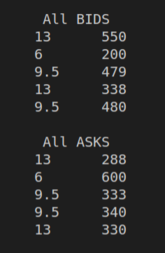
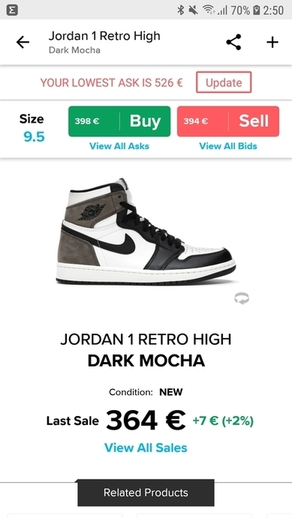
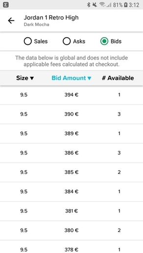
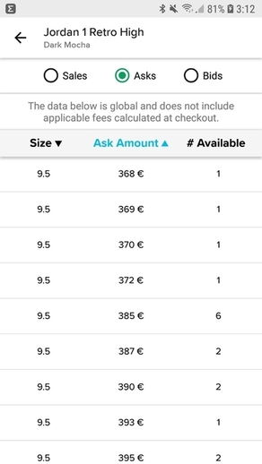

# StockX Project

Proyecto Programación DAW Dual Java de febrero de 2021, CIFP Francesc de Borja Moll, Palma (Illes Balears).

<!--Logos-->

## Tabla de Contenidos

1. [Salida de la Aplicación](#salidas-de-la-aplicacion)
1. [Historias de Usuario](#historias-de-usuario)
1. [Diagrama UML](#diagrama-uml)
1. [Tecnologías Usadas](#tecnologias-usadas)
1. [Reflexiones](#reflexiones)
1. [Licencia](#licencia)

---

## Salida de mi Aplicación

**[⬆ back to top](#tabla-de-contenidos)**

---

## Historias de Usuario
> Para ver el documento de las Historias de Usuario
Las historias de usuario están enunciadas en el script principal `Stockx.java`

1. El usuario/a solicita la info del `sneaker` en todas las tallas (ultima `sale`, máxima `bid`, mínima `ask`, `name` y estilo o `style`)

2. El usuario/a lista todas las bids de una sneaker para conocer cuál es la `minima bid`.

3. El usuario/a lista todas las asks de una sneaker para conocer cuál es la `maxima ask`.

4. El usuario/a lista todas las `sales` de una sneaker para averiguar cuál es la última venta o `last sale`.

5. El usuario/a solicita la info del sneaker en todas las tallas (ultima venta, máxima bid, mínima ask, nombre y estilo) = Historia de usuario 1.

6. El usuario/a lista la info del sneaker en una determinada talla o `size`.

7. El usuario/a lista todas las sales de una sneaker en una determinada talla o `size` para averiguar cuál es la última venta.

8. El usuario/a lista todas las bids de una sneaker en una determinada `size` para conocer cuál es la mínima bid.

9. El usuario/a lista todas las asks de una sneaker en un determinada `size` para conocer cuál es la máxima ask.

**[⬆ back to top](#tabla-de-contenidos)**

---

## Diagrama UML

**[⬆ back to top](#tabla-de-contenidos)**

---

## Tecnologías Usadas

- Java JDK 11
- Maven
- Visual Studio Code
- Git

**[⬆ back to top](#tabla-de-contenidos)**

---

## Reflexiones

---

## Licencia

MIT License

Copyright (c) 2021 Mateo Garcia Gonzalez

Permission is hereby granted, free of charge, to any person obtaining a copy
of this software and associated documentation files (the "Software"), to deal
in the Software without restriction, including without limitation the rights
to use, copy, modify, merge, publish, distribute, sublicense, and/or sell
copies of the Software, and to permit persons to whom the Software is
furnished to do so, subject to the following conditions:

The above copyright notice and this permission notice shall be included in all
copies or substantial portions of the Software.

THE SOFTWARE IS PROVIDED "AS IS", WITHOUT WARRANTY OF ANY KIND, EXPRESS OR
IMPLIED, INCLUDING BUT NOT LIMITED TO THE WARRANTIES OF MERCHANTABILITY,
FITNESS FOR A PARTICULAR PURPOSE AND NONINFRINGEMENT. IN NO EVENT SHALL THE
AUTHORS OR COPYRIGHT HOLDERS BE LIABLE FOR ANY CLAIM, DAMAGES OR OTHER
LIABILITY, WHETHER IN AN ACTION OF CONTRACT, TORT OR OTHERWISE, ARISING FROM,
OUT OF OR IN CONNECTION WITH THE SOFTWARE OR THE USE OR OTHER DEALINGS IN THE
SOFTWARE.

**[⬆ back to top](#tabla-de-contenidos)**

---

## Autor
Mateo Garcia Gonzalez